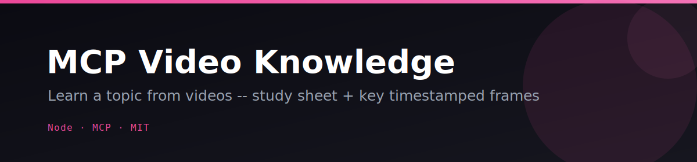
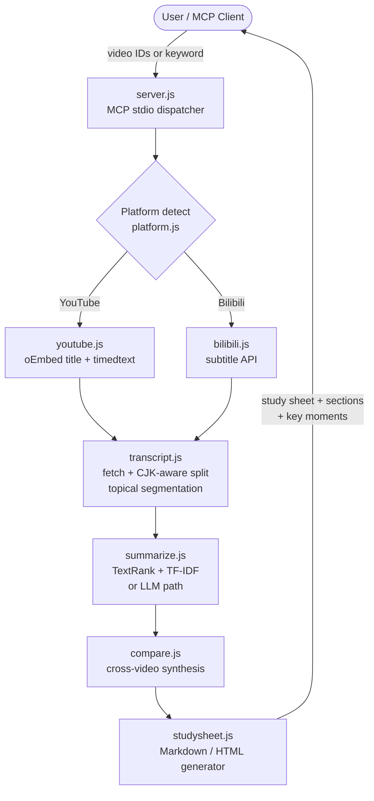

<p align="center"></p>

<p align="center">
  <a href="LICENSE"></a>
  
  
  
  
</p>

# 🎬 MCP Video Knowledge

**Point it at any YouTube or Bilibili video and get back a ready-to-read study sheet with topical sections, clickable timestamps, and thumbnail grids — no API key required for the core pipeline.**

Drop video IDs into your MCP-enabled AI client (Claude Code, Claude Desktop) and the server fetches transcripts, runs extractive TextRank summarization fully offline, segments the content into labeled topics, and synthesizes everything into a polished Markdown or self-contained HTML study sheet. An optional LLM key (Anthropic, OpenAI-compatible, or Kimi/Moonshot) upgrades the summaries to full generative quality.

---

## ✨ Features

- **Zero-key core pipeline** — transcript fetch + TextRank summarization + topical segmentation work fully offline, no credentials needed
- **YouTube & Bilibili** — auto-detects platform from IDs, BV/AV numbers, or full URLs
- **Topical segmentation** — vocabulary-shift heuristic splits each video into labeled sections with start/end timestamps and thumbnail URLs
- **Self-contained HTML study sheet** — dark-theme, inline CSS, no CDN; includes a TOC, synthesized script, responsive thumbnail grid (cards link directly to that moment in the video), and per-video keyword chips
- **Cross-video comparison** — `compare_videos` finds shared topics and unique coverage angles across up to 10 videos
- **Keyword search** — pass a topic string to auto-discover videos (requires `YOUTUBE_API_KEY`)
- **LLM upgrade path** — drop in `ANTHROPIC_API_KEY` (or any OpenAI-compatible endpoint) for generative summaries and richer comparison
- **Graceful degradation** — when transcripts are unavailable the study sheet still renders a thumbnail card grid so the output is never empty
- **Pluggable via `npx`** — no clone needed; launch directly with `npx mcp-video-knowledge`

---

## 🎬 How it works



---

## 🚀 Quickstart

### Option A — `npx` (no clone)

```bash
npx mcp-video-knowledge
```

### Option B — Local clone

```bash
git clone https://github.com/Alchemist-X/mcp-video-knowledge.git
cd mcp-video-knowledge
npm install
cp .env.example .env   # fill in any optional keys
npm start
```

### Try the offline demo (no keys, no network)

```bash
npm run demo
# HTML study sheet written to /tmp/study-sheet-demo.html
```

### Run the test suite

```bash
npm test
```

### Run the self-eval harness

```bash
npm run eval
# Spawns server over stdio, exercises every tool, prints PASS/FAIL per criterion
```

---

## Add to your MCP client

### Claude Code (`~/.claude/settings.json`)

```json
{
  "mcpServers": {
    "video-knowledge": {
      "command": "node",
      "args": ["/absolute/path/to/mcp-video-knowledge/server.js"],
      "env": {
        "ANTHROPIC_API_KEY": "sk-ant-...",
        "YOUTUBE_API_KEY": "AIza...",
        "BILIBILI_COOKIE": "SESSDATA=...; bili_jct=..."
      }
    }
  }
}
```

### Claude Desktop (`claude_desktop_config.json`)

```json
{
  "mcpServers": {
    "video-knowledge": {
      "command": "node",
      "args": ["/absolute/path/to/mcp-video-knowledge/server.js"],
      "env": {
        "ANTHROPIC_API_KEY": "sk-ant-...",
        "YOUTUBE_API_KEY": "AIza...",
        "BILIBILI_COOKIE": "SESSDATA=...; bili_jct=..."
      }
    }
  }
}
```

---

## ⚙️ Configuration

Copy `.env.example` to `.env` and set any of the following:

```bash
cp .env.example .env
```

| Variable | Required | Purpose |
|---|---|---|
| `ANTHROPIC_API_KEY` | No | Generative summarization + comparison via `claude-sonnet-4-5` |
| `YOUTUBE_API_KEY` | Only for keyword search | YouTube Data API v3 (free tier: ~100 searches/day) |
| `BILIBILI_COOKIE` | No | Bilibili logged-in subtitle access (see note below) |

### OpenAI-compatible LLM (Kimi / Moonshot / OpenAI / etc.)

The server respects standard OpenAI-compatible environment variables as an alternative to `ANTHROPIC_API_KEY`:

| Variable | Example |
|---|---|
| `LLM_API_KEY` | `sk-...` |
| `LLM_BASE_URL` | `https://api.moonshot.cn/v1` |
| `LLM_MODEL` | `moonshot-v1-8k` |

Without any LLM key the server falls back to offline TextRank extractive summarization — the full pipeline still runs, just without generative prose.

### Bilibili cookie note

Bilibili's subtitle API requires a logged-in session for most videos. Copy the full `Cookie` header from DevTools (Network tab, any bilibili.com request while logged in) and paste it as `BILIBILI_COOKIE`. Without it, only public-CC videos return subtitles; the server degrades gracefully and reports `transcriptAvailable: false`.

---

## 🛠️ MCP Tools reference

### `learn_topic`

Fetch, transcribe, and synthesize knowledge from one or more videos.

```json
{
  "keyword": "machine learning",
  "videoIds": ["dQw4w9WgXcQ", "BV1uT4y1P7CX", "https://youtu.be/abc123"],
  "maxVideos": 5
}
```

Returns a unified `script`, per-video `sections` with timestamps + thumbnail URLs, `keyMoments`, and `meta`.

### `make_study_sheet`

Generate a polished study sheet from a topic or explicit video IDs.

```json
{
  "keyword": "machine learning",
  "videoIds": ["dQw4w9WgXcQ"],
  "maxVideos": 3,
  "format": "html"
}
```

`format` is `"markdown"` (default) or `"html"`. The HTML output is fully self-contained — inline CSS, dark theme, no CDN, responsive thumbnail grid with deep-links to each timestamp.

### `summarize_transcript`

Summarize any transcript text. Works offline with no keys.

```json
{
  "transcript": "Full transcript text...",
  "focus": "neural networks"
}
```

### `compare_videos`

Contrast shared topics and unique coverage angles across 2–10 videos.

```json
{
  "videoIds": ["videoId1", "videoId2", "BV1xxxxx"],
  "maxVideos": 5
}
```

---

## 🗺️ Roadmap / Needs

This project is at MVP stage and actively open to contributions:

- **True per-frame extraction** — current key frames use standard YouTube thumbnail URLs; per-timestamp still images would require `ffmpeg` integration
- **Bilibili keyword search** — currently only YouTube Data API search is wired up
- **Persistent cache** — re-fetching transcripts on every invocation; a local SQLite/filesystem cache would speed up repeated queries
- **More LLM providers** — Gemini, Cohere, local Ollama endpoint support
- **Browser extension / bookmarklet** — one-click study sheet from the current tab

PRs and issues are welcome.

---

## 📐 Architecture

```
server.js              — MCP stdio entry point, tool registry + dispatch
src/
  platform.js          — Platform detection, ID parsing, thumbnail + deep-link builders
  youtube.js           — oEmbed title fetch, Data API keyword search
  bilibili.js          — Video info, subtitle fetch (best-effort)
  transcript.js        — Unified transcript fetch, CJK-aware splitting, topical segmentation
  summarize.js         — TextRank extractive ranking, TF-IDF keywords, LLM path
  compare.js           — Cross-video comparison (extractive + LLM)
  studysheet.js        — Markdown + self-contained HTML study sheet generator
test/
  unit.test.js         — node:test unit suite (offline pure-function paths)
  demo.js              — Offline demo harness (no keys or network required)
  sample-transcript.txt — Bundled ML transcript for offline testing
eval/
  eval.mjs             — Zero-dep pass/fail self-eval harness
  criteria.md          — Human-readable eval criteria
  offline-preload.mjs  — Network-disabling preload for deterministic eval isolation
```

---

## 📄 License

MIT © 2026 Alchemist-X

---

<p align="center">⭐ Star this repo if it saves you from watching a three-hour lecture at 1x speed.</p>
